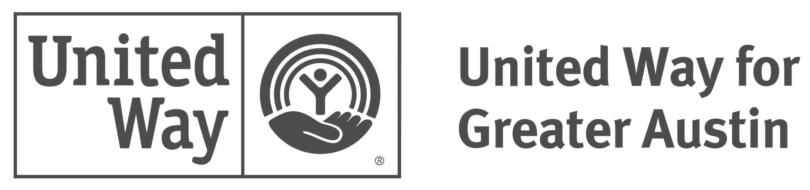

This Dashboard was developed through a joint partnership of the United Way for Greater Austin's 2-Gen Work and the 2-1-1 Navigation Center Team. 

#### The United Way for Greater Austin

United Way for Greater Austin brings people, ideas and resources together to fight poverty in our community. We are here to bring the community together in a united way – to serve as a convener of and backbone for powerful collaborations and to lead a collective fight against poverty.

Since 1924, we have been dedicated to providing families and individuals in need with the tools and resources needed to thrive. We drive impact by partnering with and investing in efforts to address the immediate needs of families in poverty while also leading efforts to address long-term community change.

#### The 2-1-1 Navigation Center

Since 1996, United Way for Greater Austin has helped residents navigate the complex system of health and human services in Central Texas by maintaining our Navigation Center. The service provides simple, one-call access to our call specialists, who can connect you to more than 30,000 nonprofit and government resources in the 10 counties we serve.

Anyone can contact the Navigation Center by simply calling the free 2-1-1 hotline. Call specialists carefully listen to each individual’s situation, then access information about the appropriate services for that individual using the 2-1-1 Texas database. Our compassionate team helps directly find callers the best navigation pathway for healthcare support, and coordinated access with several area clinic networks, including El Buen Samaritano Episcopal Mission and Bluebonnet Trails Community Services. Our specialists can even make appointments for callers for the Medical Access Program (MAP), Medicaid and the Children’s Health Insurance Program (CHIP) through our Central Health partnership.

#### 2-Gen at The United Way for Greater Austin 

As the cost of living rises in Austin, families in low-income households face limited economic mobility. Parents who want to pursue higher paying jobs are confronted with complex educational systems, time constraints, and a lack of affordable, high-quality childcare. Their children grow up with fewer resources, which often leads to poor educational outcomes and continues the cycle of poverty.

United Way’s 2-Gen approach supports families living in low-income households by intentionally providing services to parents and children simultaneously. The 2-Gen approach provides families with opportunities to further their education, build social capital, maintain their physical and mental health, and increase economic well-being and overall stability.

